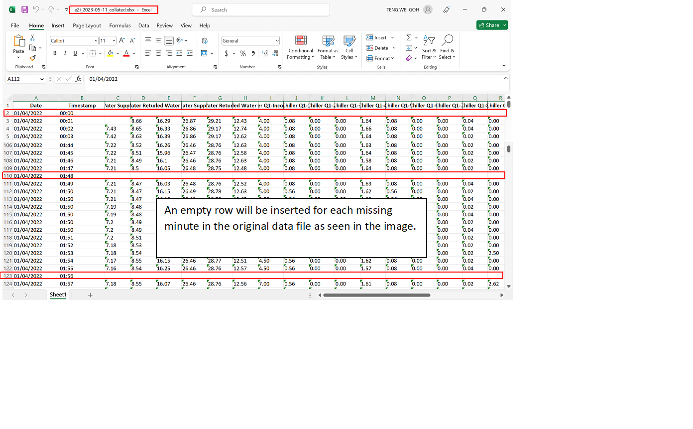
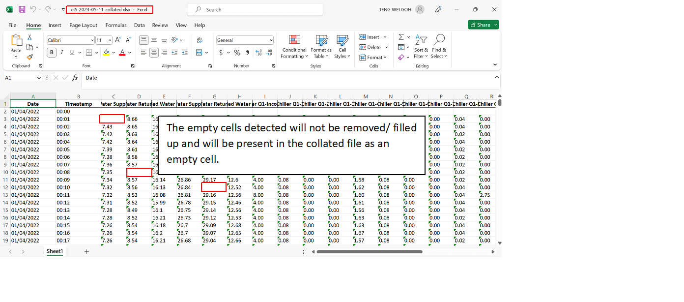

# CSV Excel Collation
This is an application that helps users with any CSV/Excel collation.  
The CSV/Excel data files will have date and timestamp, from 0000 to 2359, and the application will automatically detect and insert an empty row for any missing minute.  
It will also merge their data columns w.r.t their date and timestamp.

## Features

### Detecting Duplicate Timestamp
Automatically detect any duplicate timestamp in the CSV/Excel data files and notify the user.

### Inserting Missing Minutes
Automatically insert any missing minutes in the CSV/Excel files and notify the user.

### Detecting Empty Cells
Automatically detect any empty cell in the CSV/Excel data files and notify the user.

## Outcome
All of the CSV/Excel data files will be combined and merged w.r.t their date and timestamp to produce one collated Excel file in the same folder as the data files.

## Technology
* [PySimpleGUI](https://github.com/PySimpleGUI/PySimpleGUI) - Python package that enables Python programmers of all levels to create GUIs
* [Pandas](https://github.com/pandas-dev/pandas) - Python package that provides fast, flexible, and expressive data structures designed to make working with "relational" or "labeled" data both easy and intuitive.

## Setup
Clone this repo to your desktop and run  
 `pip install -r requirements.txt`   
 to install all dependencies.

## Development
Want to contribute? Great!

To fix a bug or enhance an existing module, follow these steps:

- Fork the repo
- Create a new branch (`git checkout -b improve-feature`)
- Make the appropriate changes in the files
- Add changes to reflect the changes made
- Commit your changes (`git commit -am 'Improve feature'`)
- Push to the branch (`git push origin improve-feature`)
- Create a Pull Request 