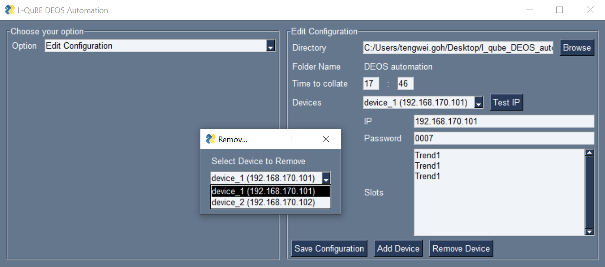

# DEOS Automation
This is an automation application that reduces the manual workload for L-QuBE by 80% during their yearly audit.  
It automates the downloading and collation of the data collected from DEOS devices, through the web browser GUI.

## Features
### Edit Configuration
Allow non-tech savvy users to edit configuration without interacting with the JSON file.

* Add Device  
Allow users to add new device information.
 

* Remove Device  
Allow users to remove existing devices.

## Daily Automate Collation
Automatic downloading and collation of DEOS data everyday.
Inform users of any error faced during collation.

* Running in the background  
Preventing accidental closure of the application.

* System notification  
Always notify users when scheduler is starting/stopping.

* Tray menu control  
Control daily collation via Windows System Tray.

## Download all data
Download all data across the entire time period.  
Manually downloading will waste alot of the user's time as the user has to wait for one file to finish downloading before downloading the next file.

## Specific slots and time period download
Allow users to choose to download specific slots over a specific time period.

## Technology
* [PySimpleGUI](https://github.com/PySimpleGUI/PySimpleGUI) - Python package that enables Python programmers of all levels to create GUIs
* [APScheduler](https://github.com/agronholm/apscheduler) - Python library that lets you schedule your Python code to be executed
* [Selenium](https://github.com/SeleniumHQ/selenium) - Automate web browser interaction from Python.

## Setup
Clone this repo to your desktop and run  
 `pip install -r requirements.txt`   
 to install all dependencies.

## Development
Want to contribute? Great!

To fix a bug or enhance an existing module, follow these steps:

- Fork the repo
- Create a new branch (`git checkout -b improve-feature`)
- Make the appropriate changes in the files
- Add changes to reflect the changes made
- Commit your changes (`git commit -am 'Improve feature'`)
- Push to the branch (`git push origin improve-feature`)
- Create a Pull Request 